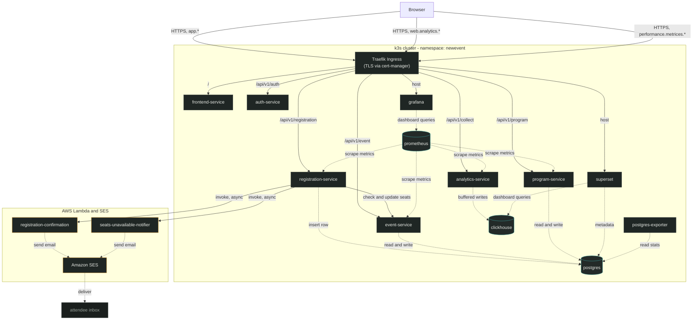
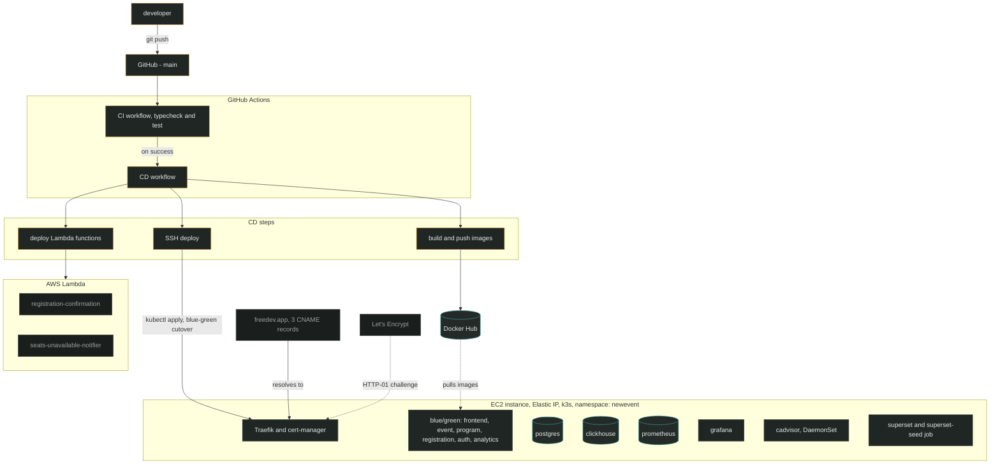

# NewEvent — Architecture Reference

Two diagrams: how a request/data moves through the running system, and separately, how a commit moves from a laptop into that system.

Both render natively on GitHub, in VS Code's Markdown preview, and by pasting the code blocks into [mermaid.live](https://mermaid.live).

## Solution architecture — request flow & data flow

Solid arrows (`-->`) are request flow. Dashed arrows (`-.->`) are data flow.

### Component notes

- **Traefik Ingress** — single entry point on 80/443; routes by hostname + path, terminates TLS issued by cert-manager.
- **registration-service** — validates seat availability against event-service, writes the registration, then fires both Lambdas asynchronously; the request never waits on email.
- **Lambda pair** — `registration-confirmation` and `seats-unavailable-notifier` each call SES directly; neither runs inside the cluster.
- **Postgres** — system of record for events, programs, registrations, plus Superset's own metadata database.
- **ClickHouse** — append-only store for web analytics events, flushed in batches by analytics-service.
- **Grafana / Superset** — read-only dashboards over Prometheus and ClickHouse respectively; neither writes back to the app.

## Deployment architecture — commit to cluster

### Component notes

- **CI workflow** — typecheck + test matrix across every service. Must pass before CD fires automatically.
- **CD workflow** — builds all six service images plus Superset, tagged with the commit SHA, never `latest`, so blue-green rollback stays meaningful.
- **Blue/green services** — each of the six has two Deployments; only one slot takes live traffic at a time, cut over after a smoke test.
- **cert-manager** — watches the Ingress, requests a Let's Encrypt certificate over HTTP-01, renews it automatically.
- **DNS** — three CNAMEs on a domain limited to CNAME/MX/SPF records, all pointing at the instance's Elastic IP hostname.
- **Superset job** — a one-shot Kubernetes Job, not a Deployment; seeds dashboards once per deploy, doesn't run continuously.
